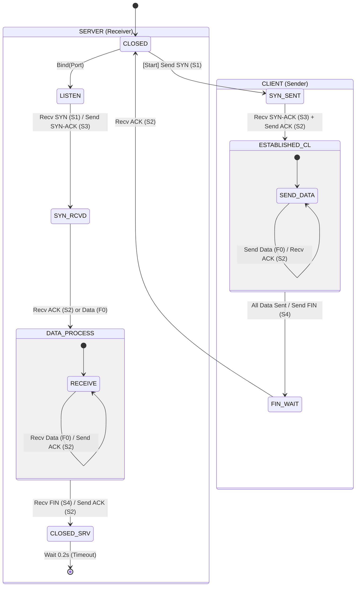
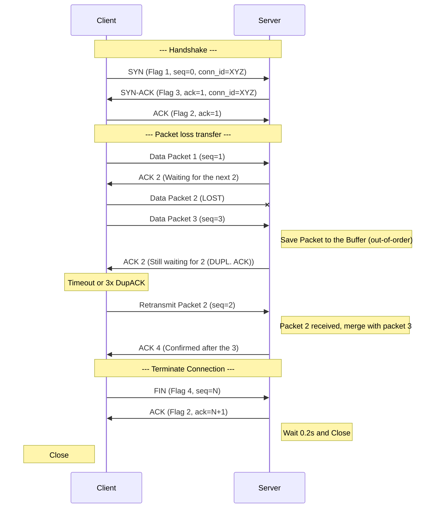

# IPK Project 2 - RDT Application
## Author: Radim Pokorný (xpokorr00)

## Project Overview
This application is implemented in C++ and is object-oriented. The main task was to
implement the sliding window in client-cerver communication with a goal to
make the communication as fast as possible. 

## Build and Run Instructions
### Prerequisites
* **Operating System:** Linux (tested on x86_64).
* **Privileges:** Root/sudo access is mandatory for raw socket operations.
* **Libraries:** `libpcap` development headers.
* **Compiler:** `gcc` with `make`.

### Compilation
To compile the project, execute the following command in the root directory:
```bash
make all
```

This produces the ipk-rdt binary.

## Testing
Python was chosen as the testing framework for a better work with proxies and to 
simulate the two terminal communication easily.

### Run the Tests
To run the tests you can run this single command 
```bash
make test
```

## Implementation details

### Datagram flow diagram


### Protocol packet/header format
Header of the packet has a
* 32 bit sequence number
* 32 bit acknowledgement number (identifier)
* 32 bit connection ID (specifies the connection)
* 16 bit checksum (detection of the corrupted data)
* 8 bit flag of the packet
    * 1 - SYN Flag
    * 2 - ACK Flag
    * 4 - FIN Flag

and the rest of the packet is made of a payload where the data are stored.

### Session Establishment and Termination
* **Establishment:** The connection starts with a handshake where the client sends a **SYN packet** 
containing a randomly generated `conn_id`. The server acknowledges this by 
returning a **SYN-ACK packet**. This process ensures that both parties are 
ready for data transfer and have synchronized their initial sequence numbers.


* **Termination:** Once the client reaches the end of the input file, 
it sends a **FIN packet**. The server processes any remaining packets 
in its buffer, writes them to the output file, and responds with a **FIN-ACK**. 
To prevent dangling connections, a final timeout (wait state) 
is implemented before the sockets are fully closed.

### Sequencing and Acknowledgement Strategy
* **Sequencing:**
To maintain the correct order of data, every packet includes a **32-bit seq_number**. 
In the implementation, sequence numbers are packet-based 
(starting from 0 for the **SYN packet** and incrementing 
by 1 for each subsequent data segment). 
This allows the receiver to reassemble the file 
even if **UDP datagrams** arrive out of order.

### Sequence diagram
There is a small demonstration of the server-client communication, where is 
simulated a packet loss.


* **Acknowledgement:**
We utilize a Cumulative Acknowledgement strategy. When the receiver accepts 
a packet that completes a continuous block of data, it sends an **ACK packet**. 
The `ack_number` indicates the highest sequence number successfully received 
in a continuous stream.

If a packet arrives out of order (creating a gap), the receiver buffers the 
out-of-order packet but continues to ACK the last "contiguous" 
sequence number, signaling to the sender that a packet is missing.

ACKs are only sent for packets that pass the checksum verification; 
corrupted packets are silently discarded.

### Retransmission Strategy and Timeout Handling
Implementation ensures reliability by using a timeout-based 
retransmission mechanism. We configure the UDP socket with a receive timeout (SO_RCVTIMEO).

* **Timeout Detection:** If the sender does not receive an expected ACK packet 
within the defined interval, the `receive()` method returns a timeout error.

* **Retransmission Logic:** Upon a timeout, the sender retransmits the 
unacknowledged segments from the current window. This process 
repeats until an ACK is received or a maximum retry limit is reached, 
at which point the connection is aborted.

* **Handling Corrupted Packets:** If a packet arrives with an invalid checksum, 
it is silently discarded. The resulting lack of an **ACK packet** eventually 
triggers a timeout and subsequent retransmission by the sender.

### Duplicate and Out-of-order Packet Handling
**Duplicate Handling:**
Duplicates are identified using the `seq_number` in the **packet header**. 
If a packet arrives with a sequence number that has already been processed, 
it is treated as a duplicate. The receiver discards the redundant payload 
but re-sends the corresponding ACK to ensure the sender can clear that 
segment from its transmission window (handling cases where the original 
ACK might have been lost).

**Out-of-order Handling:**
To handle packets arriving out of sequence, the receiver maintains a receive buffer.

* When a packet arrives with a sequence number higher than expected, 
it is stored in a temporary buffer (e.g., a map or an indexed array) 
instead of being discarded.

* As soon as the missing "gap" packets arrive, the receiver flushes the 
contiguous segments from the buffer to the output file.

* This ensures that the final file is reconstructed in the exact same order as 
the source, regardless of the network's behavior.

### Connection Identification Strategy
* **Mechanism:** Every relation has its own 32 bit `conn_id`.


* **Generating:** Client is generating a random number a sends in every packet.


* **Checking:** Server is saving this ID at the beginning and discards every packet that 
                does not have it

### Chosen Segment Size and Window Behavior
* **Segment size:** Payload size is set to 1185 bytes. It is read from STDin file
    and is stored in the buffer before sending.


* **Window behavior:** The sliding window mechanism uses 64 packets in one window. 
                        Sender is sending the packets before he gets the **ACK** for
                        the oldest not sent packet.


## Known Limitations
* Algorithm has a hard-coded value for the timeout and does not support the dynamic changes in network
* The implementation does not support flow control using the window size in ACK packets.

### Measured Behavior in the Test Development
The implementation was verified using a custom Python-based test harness 
simulating various network conditions over a local loopback interface.  
* **Clean & Empty Transfers:** The protocol achieves maximum throughput 
with zero overhead, correctly handling both standard data and empty files.  


* **Network Impairments:** Under simulated loss (5–15%), 
the Selective Repeat/Stop-and-Wait logic successfully recovered all missing segments 
through retransmissions.


* **Robustness:** The system correctly handled packet reordering 
and corruption; in all test scenarios, the MD5 hash of the received file matched 
the source perfectly.


* **Timing:** Retransmission timeouts (set to 200ms) proved 
effective in balancing reliability and transfer speed under high-latency conditions.

## Test Findings

The implementation was verified using a 
custom Python-based test harness simulating various network conditions. 
The protocol successfully passed all 17 test scenarios. In this section the python delays will 
be included in the measured units.
* **Performance 
and Scalability:** 
  * The protocol demonstrated stable performance across various 
  file sizes, successfully transferring a **100MB file** in approximately 
  **32.3 seconds.**
  * **Empty files** and small transfers (1MB–10MB) were handled with 
  minimal latency, typically under 4 seconds.


* **Resilience to Network Impairments:** 
  * **Packet Loss (15%):** The Selective Repeat logic efficiently 
  recovered from significant loss, completing the transfer in **7.5 seconds.**
  * **Corruption (2%):** Invalid packets were correctly identified via the **RFC 1071** 
  checksum algorithm and discarded, triggering successful retransmissions.  
  * **Jitter and Reordering:** The receiver's `receiveBuffer` successfully reassembled 
  out-of-order segments, ensuring file integrity even when network latency fluctuated. 


* **Stress and Stability:** 
  * Under "Extreme Stress" (10% loss, 30ms delay, 20ms jitter, 10% 
  duplication), the protocol maintained a reliable connection and finished in 12.3 
  seconds without errors.
  * To achieve these results on virtualized environments 
  (like NixOS), the testing proxy was optimized using a ThreadPoolExecutor 
  (20 workers) to handle the high volume of packets without overwhelming 
  the OS scheduler.


* **IPv6 and Dual-Stack:** The server successfully implements 
dual-stack support.  Testing verified identical behavior and performance 
on both **IPv4 (1.9s)** and **IPv6 (2.6s)** baselines.

## Artificial Intelligence Usage
### Testing
The testing framework was largely generated by AI to allow for greater flexibility in creating scripts that are easy to write and ready for immediate use. 

### Application
The use of AI also accelerated the application’s development; it was primarily used to correct various errors related to C++ syntax and semantics, as well as to explain network concepts and the implementation of libraries that were previously unfamiliar to the author.
Toward the end of development, AI was also used to clarify erroneous outputs or to locate bugs that were difficult to find.


